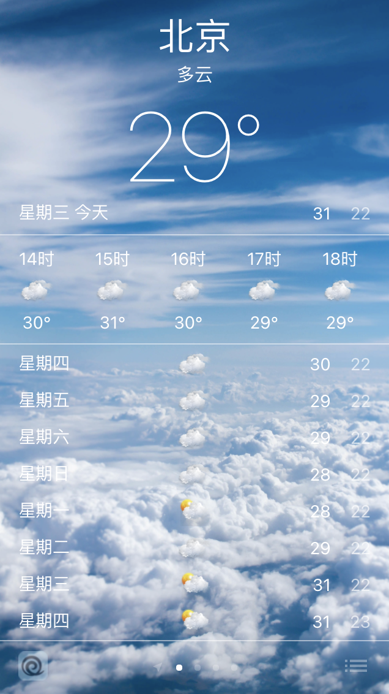
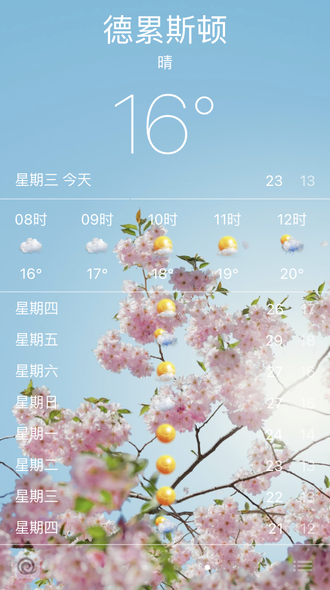
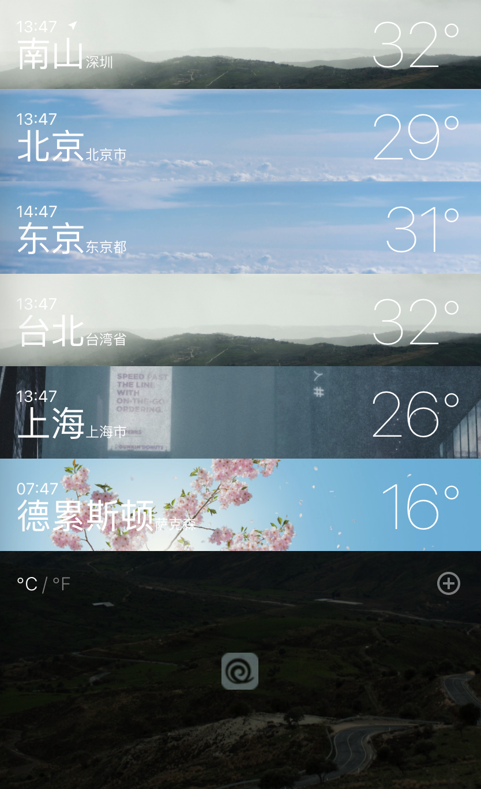
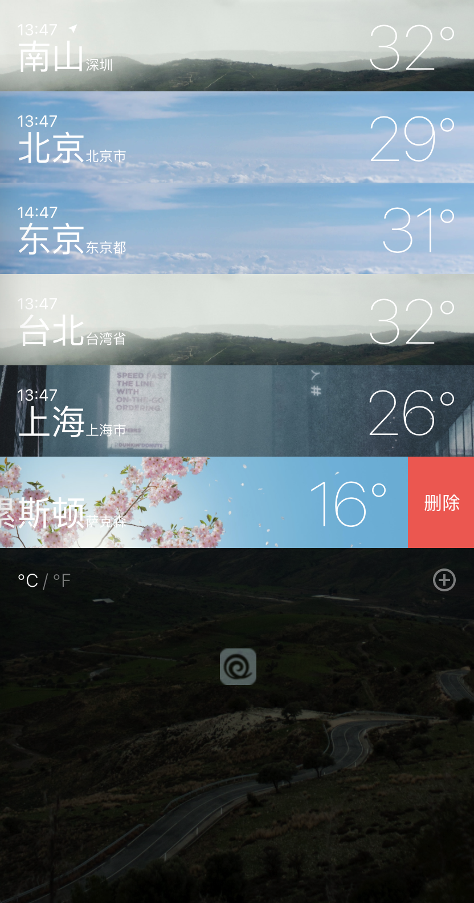
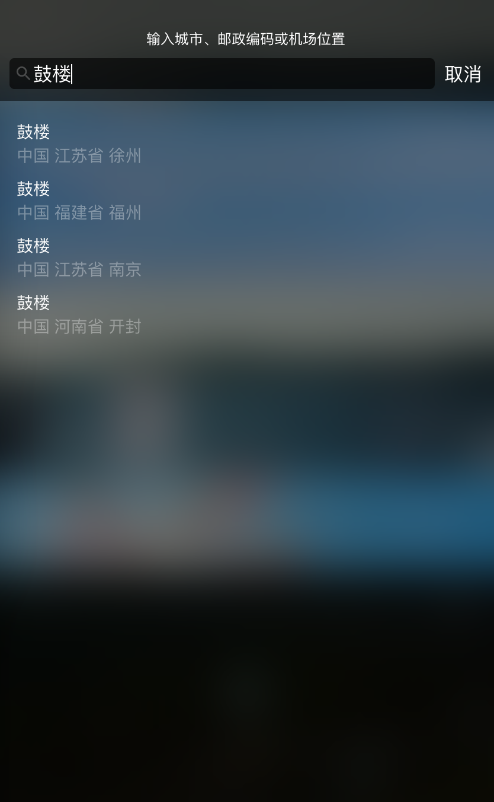

# iOS Weather

__Warning__: Google Translate

## Technology

- [React](https://reactjs.org/)
- TypeScript
- [Vite](https://vitejs.dev/)
- scss

## Screenshots

    
    
    
    
    
    

## 

## Start

- `cd weather`
- `yarn`
- `yarn dev`

## Tip

### .env.xxx

- VITE_APIKEY - [qweather](https://dev.qweather.com/en/) api key
- VITE_HFAPIURL - qweather, about weather API
- VITE_HFAPIGEO - qweather, about search API
- VITE_ICONURL - weather status icon url
  - China <https://gitee.com/goldhan/WeatherIcon/raw/masterweather-icon-S2/64>
  - Abroad <https://github.com/qwd/WeatherIcon/raw/masterweather-icon-S2/64>

## TODO

- [x] Positioning
- [x] Search
- [x] Drag Sort
- [x] Add / Delete City
- [x] world time
- [x] i18

## Hope to help you

如代码有迷糊行为请吐槽，谢谢

### 要不请我喝杯奶茶胖死我 😜

