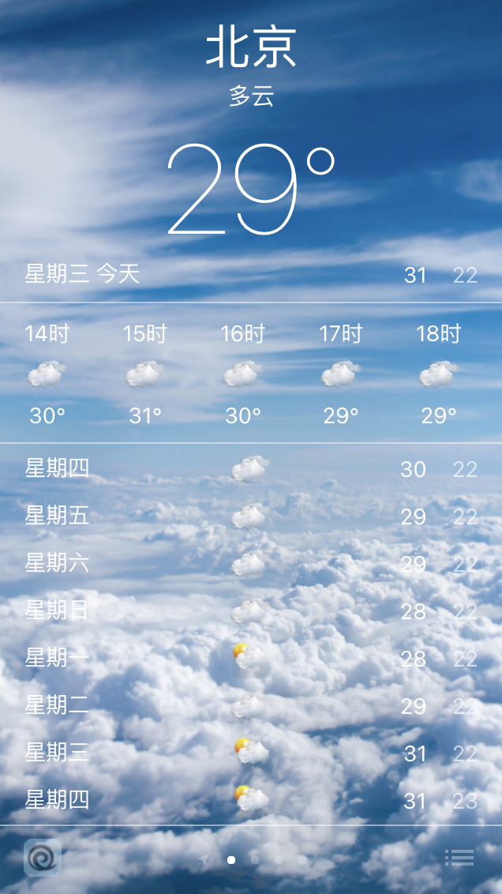
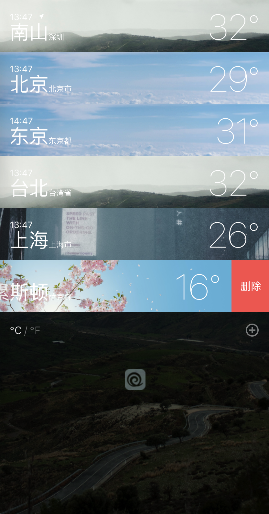

# 高仿 iOS 天气

> Demo 如有加载不出来，请科学学习

## 技术栈

- [React](https://react.docschina.org/)
- TypeScript
- [Vite](https://cn.vitejs.dev/)
- scss

## Screenshots

    
    
    
    
    
    

## Start

- `cd weather`
- `yarn`
- `yarn dev`

### PRO

- `cd weather`
- `yarn`
- `yarn build`
## Tip

### .env.xxx

- VITE_APIKEY - [和风天气](https://dev.qweather.com/) api key
- VITE_HFAPIURL - 和风天气，天气 API
- VITE_HFAPIGEO - 和风天气，关于城市搜索 API
- VITE_ICONURL - 天气状态图表拼接地址
  - China 大陆请使用 <https://gitee.com/goldhan/WeatherIcon/raw/masterweather-icon-S2/64>
  - 大陆以外可以使用 <https://raw.githubusercontent.com/qwd/WeatherIcon/master/weather-icon-S2/64>

### vite.config.ts

[vite config](https://cn.vitejs.dev/config/)
## TODO

- [x] 定位
- [x] 搜索
- [x] 拖动排序
- [x] 添加删除城市
- [x] 列表页面世界时间
- [x] 国际化

## 希望对你有所帮助

如代码有迷糊行为请吐槽，谢谢

### 要不请我喝杯奶茶胖死我 😜

